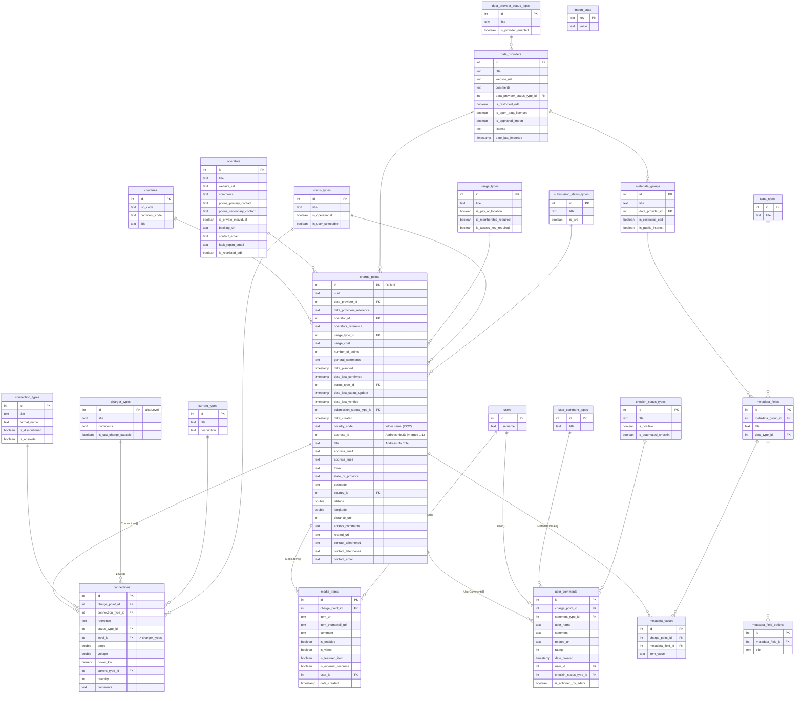

# OCM Export — Relational Database Structure

Relational model for the Open Charge Map per-POI export in this repo
(`data/referencedata.json` + `data/<ISO2>/OCM-<id>.json`, one file per charging station).

Design goals: **as simple as possible, as close to the original JSON as possible.**
All primary keys are the original OCM IDs (natural keys, no serials).
JSON `PascalCase` fields map 1:1 to `snake_case` columns.

## ER Diagram

## JSON → table mapping

| JSON source | Table |
|---|---|
| `data/<CC>/OCM-<id>.json` (top level) | `charge_points` |
| `.AddressInfo` (merged, see notes) | `charge_points` (`address_id`, `title`, `address_line1` … `contact_email`) |
| `.Connections[]` | `connections` |
| `.UserComments[]` | `user_comments` |
| `.MediaItems[]` | `media_items` |
| `.MetadataValues[]` | `metadata_values` |
| `.UserComments[].User`, `.MediaItems[].User` | `users` (deduped) |
| `referencedata.json .Countries` | `countries` |
| `… .Operators` | `operators` |
| `… .DataProviders` | `data_providers` |
| `… .DataProviders[].DataProviderStatusType` | `data_provider_status_types` (deduped) |
| `… .UsageTypes` | `usage_types` |
| `… .StatusTypes` | `status_types` |
| `… .SubmissionStatusTypes` | `submission_status_types` |
| `… .ConnectionTypes` | `connection_types` |
| `… .ChargerTypes` | `charger_types` |
| `… .CurrentTypes` | `current_types` |
| `… .UserCommentTypes` | `user_comment_types` |
| `… .CheckinStatusTypes` | `checkin_status_types` |
| `… .DataTypes` | `data_types` |
| `… .MetadataGroups` | `metadata_groups` |
| `… .MetadataGroups[].MetadataFields[]` | `metadata_fields` |
| `… .MetadataGroups[].MetadataFields[].MetadataFieldOptions[]` | `metadata_field_options` |
| (bookkeeping, not from JSON) | `import_state` |

## Design notes

- **AddressInfo is merged into `charge_points`.** Verified against the data: every one
  of 23,376 checked files has exactly one `AddressInfo` object, no `AddressInfo.ID` is
  shared between two stations, and the ID stays stable when the address is edited
  (60 address edits in one commit, 0 ID changes). Addresses are edited in place — the
  export carries no address history (history lives in git). The original
  `AddressInfo.ID` is preserved as `charge_points.address_id`.
- **`charge_points.country_code`** is the containing folder name (ISO2). It duplicates
  what `country_id → countries.iso_code` provides, but makes per-country queries and
  git-diff reconciliation trivial.
- **`ChargerTypes` = "Level".** `connections.level_id` references `charger_types.id`
  (OCM calls the same entity ChargerType in reference data and `LevelID` in connections).
- **`users`** contains only `{ID, Username}` — that is all the export embeds. Users are
  global entities: the incremental update only upserts them and never deletes a user
  whose comments/photos have disappeared, so `users` may retain rows no longer referenced.
- **`Operators[].AddressInfo`** is null for all 968 operators in the current export and
  is therefore omitted.
- **FK safety:** station files can reference IDs missing from `referencedata.json`.
  The import scripts NULL-out (and log) any dangling reference rather than fail.
- **`import_state`** stores the last-imported git commit (`key='last_commit'`) so the
  incremental update script knows its diff base.
- Types are database-neutral: `INTEGER`, `TEXT`, `BOOLEAN`, `TIMESTAMP`,
  `DOUBLE PRECISION`, `NUMERIC`. Timestamps are stored as given (UTC, `Z`-suffixed
  in source).
